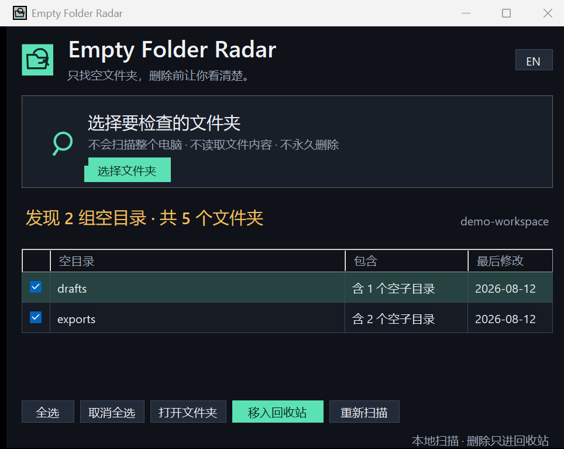

# Empty Folder Radar

**Find empty folder branches, review them clearly, and move only the ones you select to the Windows Recycle Bin.**

[中文说明](#中文说明) · [Download](https://github.com/configcrate/empty-folder-radar/releases/latest) · [ConfigCrate](https://configcrate.com/)

Empty Folder Radar extracts one focused job from large disk-cleanup suites: finding empty folders. It does not search for duplicates, caches, temporary files, or large files.



## What makes it safer

- You choose one specific folder; it never scans the whole PC automatically.
- Drive roots, Windows, Program Files, and the entire user profile are refused as scan roots.
- The selected root itself is never offered for removal.
- An empty tree such as `A/B/C` is shown as one branch (`A`, containing two empty descendants), avoiding confusing parent-and-child delete rows.
- Zero-byte files, `.gitkeep`, hidden files, and any other real file make a folder non-empty.
- Directory links and junctions are skipped instead of followed.
- Cleanup goes to the Windows Recycle Bin; permanent deletion is not available.
- Nothing is uploaded and file contents are never read.

## Use

1. Download and extract the latest Windows ZIP from [Releases](https://github.com/configcrate/empty-folder-radar/releases/latest).
2. Run `empty-folder-radar.exe`.
3. Select or drag in a folder.
4. Review the empty branches and uncheck anything you want to keep.
5. Choose **Move to Recycle Bin**.

## Why a separate app?

[Czkawka](https://github.com/qarmin/czkawka) is an excellent multi-function cleaner with duplicate, large-file, broken-file, similar-media, and empty-folder tools. Empty Folder Radar is independently implemented for users who want only the empty-folder task in one small Windows window.

Empty Folder Radar is not affiliated with Czkawka.

## Build and test

```powershell
.\scripts\build.ps1
.\scripts\build.ps1 -Release
```

Tests cover empty leaves, collapsed empty trees, mixed trees, zero-byte marker files, root protection, and descendant validation.

## 中文说明

**只找空文件夹，确认清楚后，把选中的目录移入Windows回收站。**

Empty Folder Radar 从大型磁盘清理工具中拆出了一个单独功能：查找空文件夹。它不检查重复文件、缓存、临时文件或大文件。

### 安全设计

- 只检查你选择的一个具体目录，不会自动扫描整个电脑。
- 不允许直接选择磁盘根目录、Windows、Program Files或整个用户主目录。
- 绝不会把本次选择的根目录列为删除对象。
- `A/B/C` 这种整条空目录树只显示为一组，避免父目录和子目录重复出现在删除列表。
- 即使是零字节文件、`.gitkeep`或隐藏文件，也会被视为真实内容。
- 不跟随目录链接和Junction。
- 只移入Windows回收站，不提供永久删除。
- 不上传文件，也不读取文件内容。

### 使用方法

1. 从 [Releases](https://github.com/configcrate/empty-folder-radar/releases/latest) 下载并解压Windows版本。
2. 运行 `empty-folder-radar.exe`。
3. 选择或拖入需要检查的文件夹。
4. 查看结果，取消勾选需要保留的目录。
5. 点击“移入回收站”。

Built by [ConfigCrate](https://configcrate.com/).
